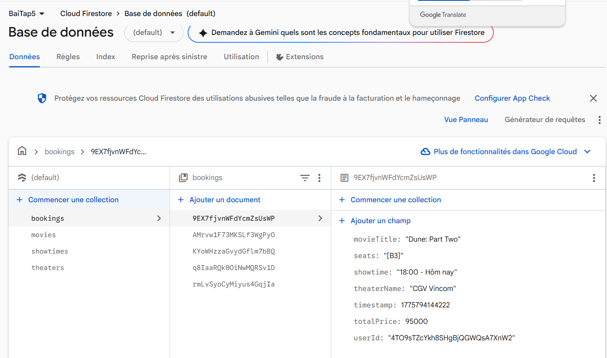
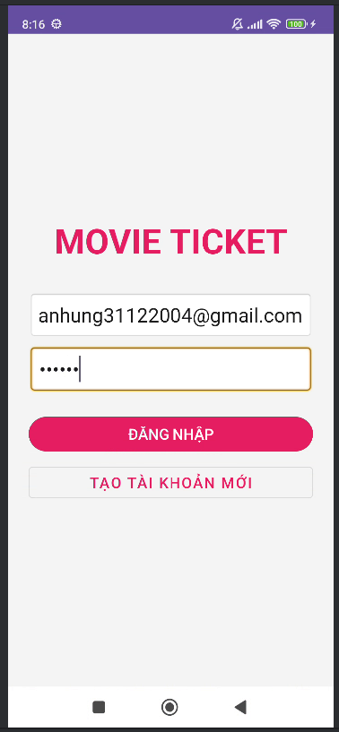
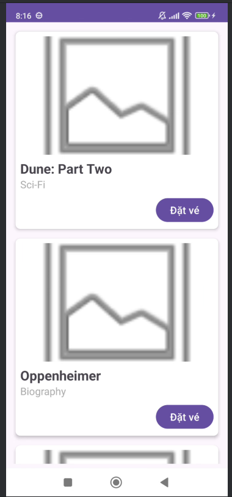
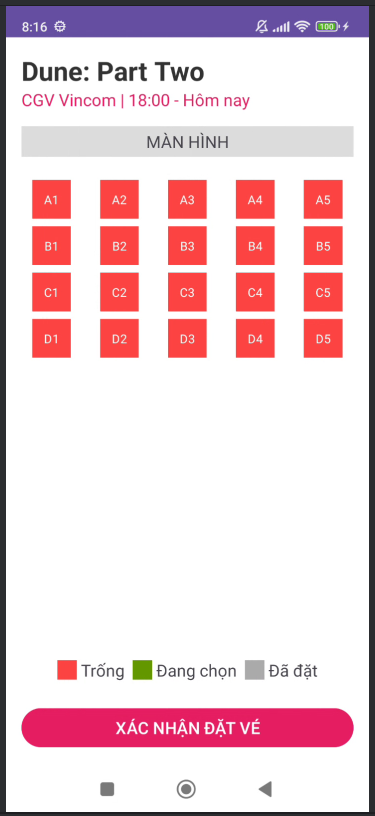
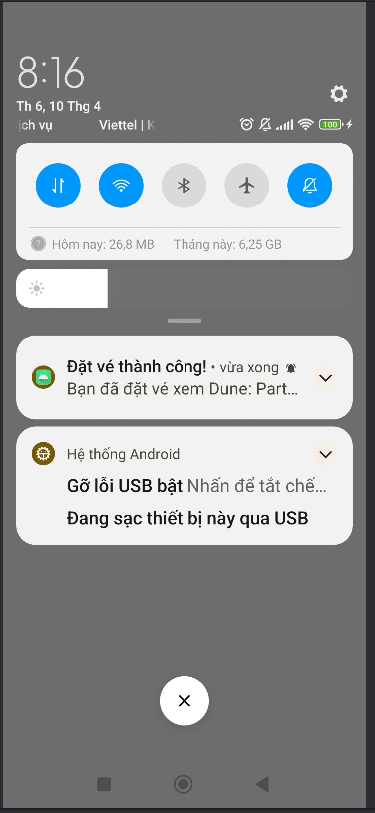

# Movie Ticket Booking App (Android Java + Firebase)

Ứng dụng đặt vé xem phim hoàn chỉnh tích hợp Firebase, được xây dựng bằng ngôn ngữ Java trên nền tảng Android Studio.

## 🚀 Tính năng chính

*   **Xác thực người dùng (Firebase Authentication)**: Đăng ký, đăng nhập an toàn với Email/Password. Tự động lưu phiên đăng nhập.
*   **Quản lý Phim (Cloud Firestore)**: Hiển thị danh sách phim kèm poster, thể loại, thời lượng và giá vé.
*   **Chọn Rạp & Suất chiếu**: Lọc danh sách rạp và giờ chiếu linh hoạt cho từng bộ phim cụ thể.
*   **Sơ đồ ghế thông minh**: 
    *   Hiển thị sơ đồ ghế theo hàng (A-D) và cột.
    *   Tự động khóa (disable) những ghế đã có người đặt trên hệ thống để tránh trùng lặp.
*   **Xác nhận đặt vé & Thanh toán**: Tóm tắt hóa đơn (Phim, Rạp, Ghế, Tổng tiền) và lưu lịch sử vào collection `bookings`.
*   **Thông báo (Notifications)**: Gửi thông báo cục bộ và thông báo từ Firebase Cloud Messaging (FCM) ngay sau khi đặt vé thành công.
*   **Khởi tạo dữ liệu mẫu**: Tự động sinh dữ liệu mẫu (Movies, Theaters, Showtimes) nếu Database trống.

## 📸 Hình ảnh minh họa

### 1. Cấu trúc Database trên Firebase

### 2. Màn hình Đăng nhập / Đăng ký

### 3. Danh sách phim đang chiếu

### 4. Sơ đồ chọn ghế & Đặt vé

### 5. Thông báo đặt vé thành công

## 🛠 Cấu trúc Database (Firestore)

*   `users`: Lưu thông tin thành viên (uid, email, name).
*   `movies`: Thông tin chi tiết các bộ phim.
*   `theaters`: Danh sách các rạp chiếu phim.
*   `showtimes`: Lịch chiếu phim liên kết giữa Movie và Theater.
*   `tickets`: Lưu trạng thái từng ghế đã được đặt cho từng suất chiếu.
*   `bookings`: Lịch sử giao dịch và tổng tiền của người dùng.

## ⚙️ Cài đặt

1.  Clone project về máy.
2.  Thêm file `google-services.json` của bạn vào thư mục `/app`.
3.  Mở Firestore và thiết lập Rules thành `allow read, write: if true;` (trong giai đoạn phát triển).
4.  Bật phương thức đăng nhập **Email/Password** trong Firebase Console.
5.  Build và Run ứng dụng.

---
**Author:** PTIT Student
**Project:** BaiTap05 - Phát triển di động
